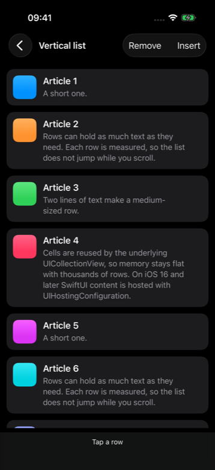
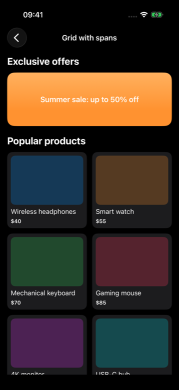
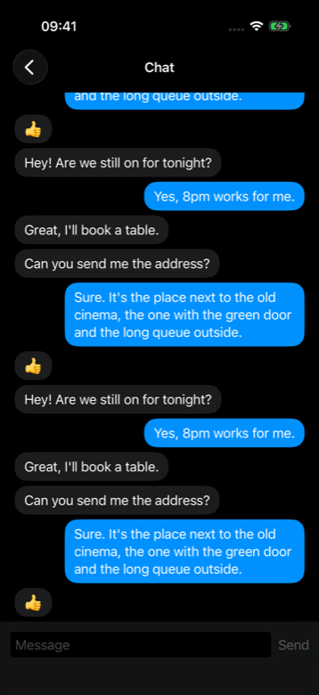
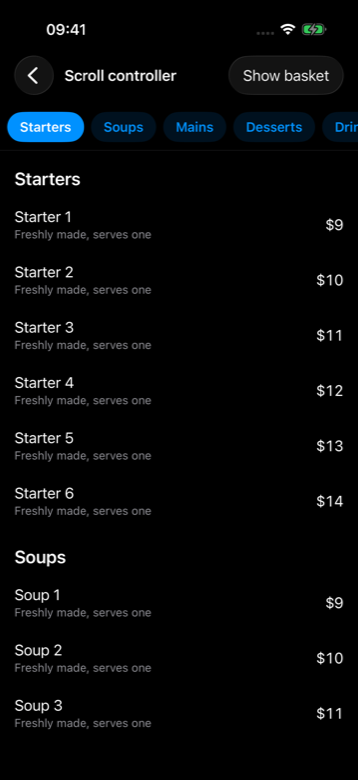

# RecyclerView for SwiftUI

[](https://github.com/ulvi-vali/recycler-view-for-swiftui/actions/workflows/ci.yml)
[](https://www.swift.org/documentation/package-manager/)
[](#requirements)
[](https://www.swift.org)
[](LICENSE)

A `UICollectionView`-backed list for **SwiftUI**, modelled on Android's **RecyclerView**. It reuses
cells, sizes every row to its SwiftUI content, and adds what SwiftUI lists leave out: grids with
items spanning several columns, chat lists anchored to the bottom, a pagination callback, and
programmatic scrolling with offsets. No dependencies, iOS 13 and later.

```swift
import RecyclerView

RecyclerView(data: articles, layout: .linear(spacing: 12)) { article in
    ArticleRow(article: article)
}
.onItemClick { index, article in
    open(article)
}
.onLoadMore(pageSize: 20) { page, _ in
    model.loadPage(page)
}
.verticalLayout(.matchParent)
```

| Self-sizing rows | Grid with spans | Chat, stacked from the end | Scroll controller |
| :---: | :---: | :---: | :---: |
|  |  |  |  |

## Contents

- [Why RecyclerView](#why-recyclerview)
- [Features](#features)
- [Installation](#installation)
- [Quick start](#quick-start)
- [Guides](#guides)
- [API reference](#api-reference)
- [How it works](#how-it-works)
- [Example app](#example-app)
- [Troubleshooting](#troubleshooting)
- [Requirements](#requirements)
- [Contributing](#contributing)
- [License](#license)

## Why RecyclerView

`List`, `LazyVStack` and `LazyVGrid` cover most screens. RecyclerView is for the screens they make
hard:

| Need | SwiftUI | RecyclerView |
| --- | --- | --- |
| Reuse row views in long lists | `List` reuses; `LazyVStack` creates views lazily but keeps them | Cells are always reused |
| Headers and banners spanning columns inside a grid | Not available in lazy grids | `spanSizeLookup` |
| Chat transcript anchored to the bottom | Manual scrolling and flipping | `stackFromEnd` / `reverseLayout` |
| Scroll to a row, leaving room for a sticky header | `ScrollViewReader` scrolls to an anchor, without an offset | `scrollToItem(at:topOffset:)` |
| Find the row under a point on screen | Not available | `indexOfItem(atScreenY:)` |
| Load the next page near the end | `onAppear` on the last rows | `onLoadMore(pageSize:)` |
| iOS 13 support | `LazyVStack` and `ScrollViewReader` need iOS 14 | iOS 13 |

It also keeps Android's vocabulary (linear and grid layout managers, `spanSizeLookup`,
`reverseLayout`, `stackFromEnd`), which makes porting an Android screen straightforward.

## Features

- **Cell reuse** through `UICollectionView`, with SwiftUI rows hosted by `UIHostingConfiguration` on
  iOS 16 and later and by `UIHostingController` before that.
- **Self-sizing rows.** Vertical lists measure each row once and use that height as the layout
  estimate, so rows do not jump as they scroll into view.
- **Linear and grid layouts**, vertical or horizontal, with per-item column spans.
- **Animated updates.** Changes are diffed by `id` off the main thread and applied as batch updates.
- **Pagination** with a single callback.
- **Chat layouts** with `stackFromEnd` and `reverseLayout`.
- **Programmatic scrolling** with `RecyclerViewController`: scroll to an item with an offset, find the
  row under a line on screen, tell user scrolling from programmatic scrolling, and add a bottom inset
  for floating bars.
- **Wrap-content or match-parent sizing**, keyboard dismissal on drag, full-bleed headers under the
  status bar.
- **UIKit support.** Use `RecyclerViewAdapter` to show SwiftUI rows in your own `UICollectionView`.

## Installation

RecyclerView is distributed with [Swift Package Manager](https://www.swift.org/documentation/package-manager/).

### Xcode

1. Choose **File › Add Package Dependencies…**
2. Enter `https://github.com/ulvi-vali/recycler-view-for-swiftui.git`
3. Select **Up to Next Major Version** from `1.0.0` and add the **RecyclerView** library to your app
   target.

### Package.swift

```swift
dependencies: [
    .package(url: "https://github.com/ulvi-vali/recycler-view-for-swiftui.git", from: "1.0.0")
],
targets: [
    .target(
        name: "YourApp",
        dependencies: [
            .product(name: "RecyclerView", package: "recycler-view-for-swiftui")
        ]
    )
]
```

## Quick start

```swift
import RecyclerView
import SwiftUI

struct Contact: Identifiable {
    let id: UUID
    let name: String
    let email: String
}

struct ContactsScreen: View {
    let contacts: [Contact]

    var body: some View {
        RecyclerView(data: contacts, layout: .linear(spacing: 8)) { contact in
            VStack(alignment: .leading, spacing: 4) {
                Text(contact.name).font(.headline)
                Text(contact.email).font(.subheadline).foregroundColor(.secondary)
            }
            .frame(maxWidth: .infinity, alignment: .leading)
            .padding()
            .background(Color(.secondarySystemBackground))
            .cornerRadius(12)
        }
        .onItemClick { index, contact in
            print("Tapped \(contact.name) at \(index)")
        }
        .verticalLayout(.matchParent)
    }
}
```

> **Note**
> A `RecyclerView` sizes itself to its rows by default (`.wrapContent`). For a list that fills the
> screen, add `.verticalLayout(.matchParent)`.

## Guides

### Layouts

```swift
.linear()                                          // vertical list
.linear(spacing: 12)                               // 12pt between rows and around the content
.linear(orientation: .horizontal, spacing: 8)      // horizontal list
.grid(spanCount: 2, spacing: 12)                   // two-column grid
.grid(spanCount: 3, spacing: 8, orientation: .horizontal) // horizontal grid with three rows
```

### Grid with column spans

`spanSizeLookup` returns how many columns an item takes, like Android's
`GridLayoutManager.SpanSizeLookup`. Spans are clamped to `1...spanCount`, and an item that does not
fit on the current row starts a new one.

```swift
enum FeedItem: Identifiable {
    case header(id: Int, title: String)
    case banner(id: Int, title: String)
    case product(id: Int, name: String, price: String)

    var id: Int {
        switch self {
        case .header(let id, _), .banner(let id, _), .product(let id, _, _): return id
        }
    }
}

RecyclerView(data: feed, layout: .grid(spanCount: 2, spacing: 12)) { item in
    switch item {
    case .header(_, let title):
        Text(title).font(.title2.bold()).frame(maxWidth: .infinity, alignment: .leading)
    case .banner(_, let title):
        BannerView(title: title)
    case .product(_, let name, let price):
        ProductCard(name: name, price: price)
    }
}
.spanSizeLookup { item in
    if case .product = item { return 1 }
    return 2 // headers and banners take the full width
}
.verticalLayout(.matchParent)
```

### Infinite scrolling and pagination

```swift
RecyclerView(data: model.articles) { article in
    ArticleRow(article: article)
}
.onLoadMore(pageSize: 20) { page, itemCount in
    model.loadPage(page) // page == itemCount / 20
}
.verticalLayout(.matchParent)
```

The callback fires when one of the last five rows is displayed **and** the item count is a multiple
of `pageSize`. It fires once per page and re-arms when items are appended, so a final page with fewer
than `pageSize` items ends pagination by itself.

### Chat: stackFromEnd and reverseLayout

| Modifier | Order of `data` | Behaviour |
| --- | --- | --- |
| `.stackFromEnd(true)` | Oldest first; append new messages | The last item sits at the bottom, and the list starts there |
| `.reverseLayout(true)` | Newest first; insert new messages at index 0 | The first item sits at the bottom, and the list starts there |

```swift
RecyclerView(data: messages, layout: .linear(spacing: 6)) { message in
    MessageBubble(message: message)
}
.stackFromEnd(true)
.dismissesKeyboardOnScroll()
.verticalLayout(.matchParent)
```

Indices passed to the row builder and to `onItemClick` always refer to positions in `data`.

### Scrolling programmatically

Keep a `RecyclerViewController` for as long as the view lives, and attach it with `.controller(_:)`:

```swift
struct MenuScreen: View {
    @State private var controller = RecyclerViewController()
    let rows: [MenuRow]

    var body: some View {
        RecyclerView(data: rows) { row in
            MenuRowView(row: row)
        }
        .controller(controller)
        .verticalLayout(.matchParent)
    }

    func showSection(at index: Int) {
        // Leave 56pt above the header for a sticky tab bar.
        controller.scrollToItem(at: index, topOffset: 56)
    }
}
```

To keep a tab bar in sync with the list, ask which row is under the bar while the **user** scrolls:

```swift
.onScroll { _ in
    guard controller.isUserScrolling,
          let index = controller.indexOfItem(atScreenY: tabBarBottomY) else { return }
    selectedSection = rows[index].section
}
```

`isUserScrolling` is `false` during programmatic scrolls, so tapping a tab is not undone by the rows
the list passes on its way.

### Content under a floating bar

Padding a list stops its content at the edge of a bar that floats over it. A content inset lets the
content run underneath while the last row can still be scrolled clear:

```swift
.onChange(of: isCheckoutVisible) { visible in
    controller.setBottomInset(visible ? 72 : 0, animated: true, duration: 0.3)
}
```

### Rows that depend on their position

```swift
RecyclerView(data: tags, layout: .linear(orientation: .horizontal)) { index, tag in
    TagChip(tag: tag)
        .padding(.leading, index == 0 ? 16 : 4)
        .padding(.trailing, index == tags.count - 1 ? 16 : 4)
}
```

### More options

```swift
.dismissesKeyboardOnScroll()     // dismiss the keyboard when the list is dragged
.withoutStatusBar()              // draw the list under the status bar, for a full-bleed header
.showsScrollIndicator(true)      // show the scroll indicator
.withAnimation(false)            // apply insertions and removals without animation
.precomputesItemHeights(false)   // skip up-front row measurement for very large data sets
```

### Using SwiftUI rows in UIKit

```swift
final class ContactsViewController: UIViewController {
    private lazy var collectionView = UICollectionView(frame: .zero, collectionViewLayout: makeLayout())
    private var adapter: RecyclerViewAdapter<Contact, ContactRow>!

    override func viewDidLoad() {
        super.viewDidLoad()
        adapter = RecyclerViewAdapter(collectionView: collectionView) { contact in
            ContactRow(contact: contact)
        }
        adapter.onItemClick = { index, contact in print(contact.name) }
        adapter.items = contacts
        adapter.notifyDataSetChanged()
    }
}
```

The collection view holds its data source weakly, so keep a strong reference to the adapter.

## API reference

Full documentation is written as DocC comments and can be browsed in Xcode with
**Product › Build Documentation**.

### RecyclerView

| API | Description |
| --- | --- |
| `init(data:layout:content:)` | Builds a row from each item. `layout` defaults to `.linear()`. |
| `init(data:layout:content:)` with `(Int, Item)` | Builds a row from each item and its index. |
| `.spanSizeLookup(_:)` | Columns each item spans in a vertical grid. |
| `.verticalLayout(_:)` | `.wrapContent` (default) sizes to the rows; `.matchParent` fills the container. |
| `.reverseLayout(_:)` | Flips the list so the first item is at the bottom. |
| `.stackFromEnd(_:)` | Anchors items to the bottom while keeping their order. |
| `.withoutStatusBar(_:)` | Extends the list under the status bar (iOS 15+). |
| `.precomputesItemHeights(_:)` | Measures vertical rows up front for stable scrolling. On by default. |
| `.showsScrollIndicator(_:)` | Shows or hides the scroll indicator. Hidden by default. |
| `.withAnimation(_:)` | Animates insertions and removals. On by default. |
| `.dismissesKeyboardOnScroll(_:)` | Dismisses the keyboard when the list is dragged. |
| `.controller(_:)` | Attaches a `RecyclerViewController`. |
| `.onItemClick(_:)` | Called with the index and item when a row is tapped. |
| `.onScroll(_:)` | Called with the content offset as the list scrolls. |
| `.onLoadMore(pageSize:perform:)` | Called with the next page index and the item count near the end. |

### RecyclerViewController

| API | Description |
| --- | --- |
| `scrollToItem(at:topOffset:animated:)` | Scrolls until the item's leading edge is `topOffset` from the start of the visible area. |
| `scrollToItem(at:screenY:animated:)` | Scrolls a vertical list until the item's top edge sits on a line in window coordinates. |
| `indexOfItem(atScreenY:)` | The first item crossing a horizontal line in window coordinates. |
| `isUserScrolling` | Whether the user is dragging the list or it is decelerating from a drag. |
| `setBottomInset(_:animated:duration:)` | Adds scrollable room below the content. |

### RecyclerViewLayoutManager

| Case | Description |
| --- | --- |
| `.linear(orientation:spacing:)` | A single column or row. |
| `.grid(spanCount:spacing:orientation:)` | `spanCount` columns (vertical) or rows (horizontal). |

## How it works

- `RecyclerView` is a `UIViewRepresentable` around `UIRecyclerView`, a `UICollectionView` with a
  compositional layout built from `RecyclerViewLayoutManager`.
- `RecyclerViewAdapter` is the data source and delegate. Each `ViewHolder` cell hosts the row with
  `UIHostingConfiguration` on iOS 16 and later, or an embedded `UIHostingController` on iOS 13–15.
- When `data` changes, the old and new identities are diffed on a background queue and applied with
  `performBatchUpdates`. An update that arrives first supersedes a diff still in flight, and each diff
  is measured from the items the collection view actually holds.
- Vertical linear lists measure each row once per item and width, the same way the cell sizes itself,
  and pass the result to the layout as the estimated height.
- Reversed layouts rotate the collection view by 180° and rotate each cell back.

## Example app

[`Examples/RecyclerViewExample`](Examples/RecyclerViewExample) contains a demo for each feature:
a vertical list with inserts and removals, a grid with spans, horizontal lists, pagination, a chat,
and section tabs driven by `RecyclerViewController`. Open `RecyclerViewExample.xcodeproj` and run it on
an iOS 16 or later simulator; it builds against the local copy of the package.

## Troubleshooting

**A modifier such as `.onLoadMore` does not exist after `.padding()`.**
RecyclerView's modifiers are declared on `RecyclerView` itself. Apply them before general SwiftUI
modifiers.

**The list is only as tall as its rows, or is cut off.**
Lists default to `.wrapContent`. Use `.verticalLayout(.matchParent)` for a list that fills the screen.

**`onLoadMore` never fires.**
It only fires while the item count is a multiple of `pageSize`. Make sure every page except the last
contains exactly `pageSize` items.

**Rows show old data after an update.**
Give each item a stable `id` that changes only when the item is a different item.

## Requirements

- iOS 13.0 or later
- Xcode 15 or later (Swift 5.9)

## Contributing

Issues and pull requests are welcome. See [CONTRIBUTING.md](CONTRIBUTING.md) for how to run the tests,
and [CHANGELOG.md](CHANGELOG.md) for release notes.

## License

RecyclerView is available under the MIT license. See [LICENSE](LICENSE) for details.
