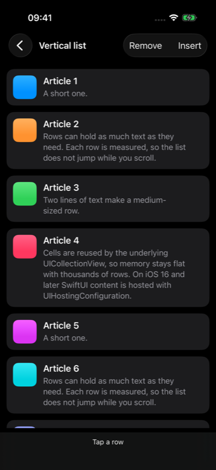
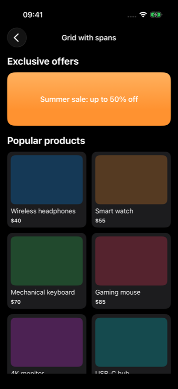
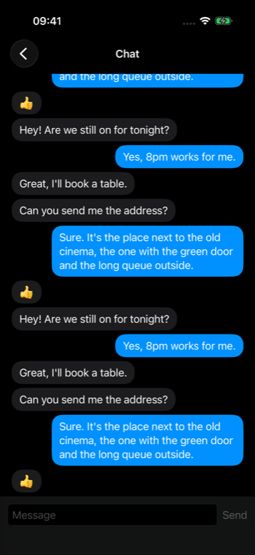
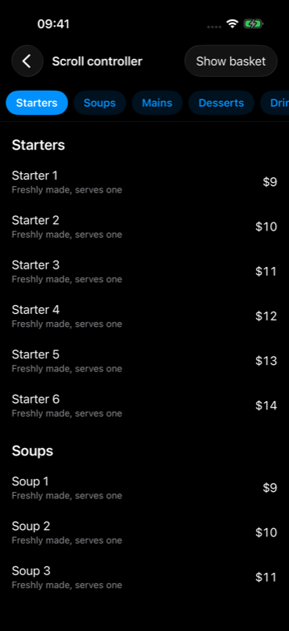

# RecyclerView for SwiftUI

[](https://github.com/ulvi-vali/recycler-view-for-swiftui/actions/workflows/ci.yml)
[](https://www.swift.org/documentation/package-manager/)
[](#requirements)
[](https://www.swift.org)
[](LICENSE)
[](https://buymeacoffee.com/ulvivali)

A `UICollectionView`-backed list for **SwiftUI**, modelled on Android's **RecyclerView**. It reuses
cells, sizes every row to its SwiftUI content, and adds what SwiftUI lists leave out: grids with
items spanning several columns, chat lists anchored to the bottom, a pagination callback, and
programmatic scrolling with offsets. No dependencies, iOS 13 and later.

```swift
import RecyclerView

RecyclerView(data: articles, layout: .linear(spacing: 12)) { article in
    ArticleRow(article: article)
}
.onItemClick { index, article in
    open(article)
}
.onLoadMore(pageSize: 20) { page, _ in
    model.loadPage(page)
}
.verticalLayout(.matchParent)
```

| Self-sizing rows | Grid with spans | Chat, stacked from the end | Scroll controller |
| :---: | :---: | :---: | :---: |
|  |  |  |  |

## Contents

- [Why RecyclerView](#why-recyclerview)
- [Features](#features)
- [Installation](#installation)
- [Quick start](#quick-start)
- [Guides](#guides)
- [API reference](#api-reference)
- [How it works](#how-it-works)
- [Example app](#example-app)
- [Troubleshooting](#troubleshooting)
- [Migrating from 1.x](#migrating-from-1x)
- [Requirements](#requirements)
- [Contributing](#contributing)
- [Support](#support)
- [License](#license)

## Why RecyclerView

`List`, `LazyVStack` and `LazyVGrid` cover most screens. RecyclerView is for the screens they make
hard:

| Need | SwiftUI | RecyclerView |
| --- | --- | --- |
| Reuse row views in long lists | `List` reuses; `LazyVStack` creates views lazily but keeps them | Cells are always reused |
| Headers and banners spanning columns inside a grid | Not available in lazy grids | `spanSizeLookup` |
| Chat transcript anchored to the bottom | Manual scrolling and flipping | `stackFromEnd` / `reverseLayout` |
| Scroll to a row, leaving room for a sticky header | `ScrollViewReader` scrolls to an anchor, without an offset | `scrollToItem(at:topOffset:)` |
| Find the row under a point on screen | Not available | `indexOfItem(atScreenY:)` |
| Load the next page near the end | `onAppear` on the last rows | `onLoadMore(pageSize:)` |
| iOS 13 support | `LazyVStack` and `ScrollViewReader` need iOS 14 | iOS 13 |

It also keeps Android's vocabulary (linear and grid layout managers, `spanSizeLookup`,
`reverseLayout`, `stackFromEnd`), which makes porting an Android screen straightforward.

## Features

- **Cell reuse** through `UICollectionView`, with SwiftUI rows hosted by `UIHostingConfiguration` on
  iOS 16 and later and by `UIHostingController` before that.
- **Self-sizing rows.** Vertical lists measure each row once and use that height as the layout
  estimate, so rows do not jump as they scroll into view.
- **Linear and grid layouts**, vertical or horizontal.
- **Separators** between the rows of linear lists, with a colour, thickness and insets, drawn without
  affecting row heights.
- **Column spans with `spanSizeLookup`.** Decide per item how many columns it takes, like Android's
  `GridLayoutManager.SpanSizeLookup`, so full-width section headers and banners can sit in the same
  grid as regular cells. Spans are clamped to the column count, and an item that does not fit on the
  current row starts a new one.
- **Animated updates.** Changes are diffed by `id` off the main thread and applied as batch updates,
  with reordered items moved rather than deleted and inserted again.
- **Pagination** with a single callback.
- **Chat layouts** with `stackFromEnd` and `reverseLayout`.
- **Programmatic scrolling** with `RecyclerViewController`: scroll to an item with an offset, find the
  row under a line on screen, tell user scrolling from programmatic scrolling, and set content
  insets on any edge for floating bars.
- **Wrap-content or match-parent sizing.** Wrap-content lists measure against the width and height
  their container proposes, so they fit cards, sheets and custom navigation hosts alike.
- **Placeholder rows** with `RecyclerViewItem`, or by passing an array of optionals.
- **Swift 6 ready.** Built in the Swift 6 language mode with strict concurrency checking.
- Keyboard dismissal on drag, scoped to the list or the whole window, and full-bleed headers under
  the status bar.
- **UIKit support.** Use `RecyclerViewAdapter` to show SwiftUI rows in your own `UICollectionView`.

## Installation

RecyclerView is distributed with [Swift Package Manager](https://www.swift.org/documentation/package-manager/).

### Xcode

1. Choose **File › Add Package Dependencies…**
2. Enter `https://github.com/ulvi-vali/recycler-view-for-swiftui.git`
3. Select **Up to Next Major Version** from `2.2.0` and add the **RecyclerView** library to your app
   target.

### Package.swift

```swift
dependencies: [
    .package(url: "https://github.com/ulvi-vali/recycler-view-for-swiftui.git", from: "2.2.0")
],
targets: [
    .target(
        name: "YourApp",
        dependencies: [
            .product(name: "RecyclerView", package: "recycler-view-for-swiftui")
        ]
    )
]
```

## Quick start

```swift
import RecyclerView
import SwiftUI

struct Contact: Identifiable {
    let id: UUID
    let name: String
    let email: String
}

struct ContactsScreen: View {
    let contacts: [Contact]

    var body: some View {
        RecyclerView(data: contacts, layout: .linear(spacing: 8)) { contact in
            VStack(alignment: .leading, spacing: 4) {
                Text(contact.name).font(.headline)
                Text(contact.email).font(.subheadline).foregroundColor(.secondary)
            }
            .frame(maxWidth: .infinity, alignment: .leading)
            .padding()
            .background(Color(.secondarySystemBackground))
            .cornerRadius(12)
        }
        .onItemClick { index, contact in
            print("Tapped \(contact.name) at \(index)")
        }
        .verticalLayout(.matchParent)
    }
}
```

> **Note**
> A `RecyclerView` sizes itself to its rows by default (`.wrapContent`). For a list that fills the
> screen, add `.verticalLayout(.matchParent)`.

## Guides

### Layouts

```swift
.linear()                                          // vertical list
.linear(spacing: 12)                               // 12pt between rows and around the content
.linear(orientation: .horizontal, spacing: 8)      // horizontal list
.grid(spanCount: 2, spacing: 12)                   // two-column grid
.grid(spanCount: 3, spacing: 8, orientation: .horizontal) // horizontal grid with three rows
```

### Wrap content

A wrap-content list measures its rows at the width its container proposes, the same way it lays them
out, so a list inside a card or a narrow column is measured at that width rather than the screen's.
Its height is capped only by the height the container proposes: in a `VStack` next to other views it
takes what is left and scrolls, and in a vertical `ScrollView` it is as tall as all of its rows. It
makes no assumptions about the window, navigation bars or headers, so it works inside any container,
including custom navigation hosts.

```swift
VStack(spacing: 0) {
    Header()
    RecyclerView(data: results) { result in   // as tall as its rows, at most the space left
        ResultRow(result: result)
    }
}
```

On iOS 16 and later SwiftUI asks the list for its size directly. On iOS 13–15 the list measures
itself once it has been laid out and settles on its height in a second layout pass.

### Separators

Linear lists have no separators by default. Add them with `.separator(...)`:

```swift
RecyclerView(data: contacts) { contact in
    ContactRow(contact: contact)
}
.separator()                                                      // system colour, hairline
.separator(color: .gray.opacity(0.3), thickness: 1,
           insets: EdgeInsets(top: 0, leading: 72, bottom: 0, trailing: 0)) // clear of an avatar
.separator(drawAfterLast: true)                                   // a line after the last row too
```

Separators sit between rows, not after the last one unless `drawAfterLast` is set. With spacing in
the layout, a separator is centred in the gap between two rows; without, it lies along the inside of
the row's bottom edge, as in a table. Horizontal lists draw them along the trailing edge, inset by
the top and bottom insets. Separators are placed from the rows' final frames and take no space of
their own, so row heights and the height of a wrap-content list are the same with or without them.
Grids have no separators.

### Grid with column spans

`spanSizeLookup` returns how many columns an item takes, like Android's
`GridLayoutManager.SpanSizeLookup`. Spans are clamped to `1...spanCount`, and an item that does not
fit on the current row starts a new one.

```swift
enum FeedItem: Identifiable {
    case header(id: Int, title: String)
    case banner(id: Int, title: String)
    case product(id: Int, name: String, price: String)

    var id: Int {
        switch self {
        case .header(let id, _), .banner(let id, _), .product(let id, _, _): return id
        }
    }
}

RecyclerView(data: feed, layout: .grid(spanCount: 2, spacing: 12)) { item in
    switch item {
    case .header(_, let title):
        Text(title).font(.title2.bold()).frame(maxWidth: .infinity, alignment: .leading)
    case .banner(_, let title):
        BannerView(title: title)
    case .product(_, let name, let price):
        ProductCard(name: name, price: price)
    }
}
.spanSizeLookup { item in
    if case .product = item { return 1 }
    return 2 // headers and banners take the full width
}
.verticalLayout(.matchParent)
```

### Updates and moves

Assign a new array and the list works out what changed by comparing `id`s: rows that left are
deleted, new rows are inserted, and rows that changed position are moved, keeping their cells and
animating to their new place. All three are applied in one batch update.

```swift
model.tasks.sort { $0.dueDate < $1.dueDate }   // rows slide into their new order
model.tasks.insert(newTask, at: 0)             // inserted
model.tasks.removeAll { $0.isDone }            // deleted
```

Give each item a stable `id`. An `id` that changes with the item's position or contents turns every
move into a deletion and an insertion.

### Infinite scrolling and pagination

```swift
RecyclerView(data: model.articles) { article in
    ArticleRow(article: article)
}
.onLoadMore(pageSize: 20) { page, itemCount in
    model.loadPage(page) // page == itemCount / 20
}
.verticalLayout(.matchParent)
```

The callback fires when one of the last five rows is displayed **and** the item count is a multiple
of `pageSize`. It fires once per page and re-arms when items are appended, so a final page with fewer
than `pageSize` items ends pagination by itself.

### Chat: stackFromEnd and reverseLayout

| Modifier | Order of `data` | Behaviour |
| --- | --- | --- |
| `.stackFromEnd(true)` | Oldest first; append new messages | The last item sits at the bottom, and the list starts there |
| `.reverseLayout(true)` | Newest first; insert new messages at index 0 | The first item sits at the bottom, and the list starts there |

```swift
RecyclerView(data: messages, layout: .linear(spacing: 6)) { message in
    MessageBubble(message: message)
}
.stackFromEnd(true)
.dismissesKeyboardOnScroll(.window) // the composer is outside the list
.verticalLayout(.matchParent)
```

Indices passed to the row builder and to `onItemClick` always refer to positions in `data`.

### Scrolling programmatically

Keep a `RecyclerViewController` for as long as the view lives, and attach it with `.controller(_:)`:

```swift
struct MenuScreen: View {
    @State private var controller = RecyclerViewController()
    let rows: [MenuRow]

    var body: some View {
        RecyclerView(data: rows) { row in
            MenuRowView(row: row)
        }
        .controller(controller)
        .verticalLayout(.matchParent)
    }

    func showSection(at index: Int) {
        // Leave 56pt above the header for a sticky tab bar.
        controller.scrollToItem(at: index, topOffset: 56)
    }
}
```

To keep a tab bar in sync with the list, ask which row is under the bar while the **user** scrolls:

```swift
.onScroll { _ in
    guard controller.isUserScrolling,
          let index = controller.indexOfItem(atScreenY: tabBarBottomY) else { return }
    selectedSection = rows[index].section
}
```

`isUserScrolling` is `false` during programmatic scrolls, so tapping a tab is not undone by the rows
the list passes on its way.

### Content insets and floating bars

Padding a list stops its content at the edge of a bar that floats over it. A content inset lets the
content run underneath while the first and last rows can still be scrolled clear. The scroll
indicators are inset by the same amounts.

```swift
// A header floating over the top and a toolbar over the bottom.
controller.setContentInsets(UIEdgeInsets(top: 56, left: 0, bottom: 72, right: 0))

// Only the bottom edge, animated together with a bar sliding in or out.
.onChange(of: isCheckoutVisible) { visible in
    controller.setBottomInset(visible ? 72 : 0, animated: true, duration: 0.3)
}
```

Edges refer to the list as it appears on screen, so a chat list flipped by `stackFromEnd` or
`reverseLayout` still takes its bottom inset at the bottom of the screen. `contentInsets` reads the
current insets back.

### Placeholder rows

To show skeleton rows while content loads, use `RecyclerViewItem`, which is either a `.value` or a
`.placeholder` in a numbered slot. Placeholders have identities of their own, so they are diffed
like any other row, and replacing them with loaded values animates as removals and insertions.

```swift
let rows: [RecyclerViewItem<Article>] = model.isLoading
    ? RecyclerViewItem.placeholders(count: 6)
    : model.articles.map(RecyclerViewItem.value)

RecyclerView(data: rows) { row in
    switch row {
    case .value(let article): ArticleRow(article: article)
    case .placeholder: ArticleRow.skeleton
    }
}
```

An array of optionals works too. `nil` elements become placeholders identified by their position,
and the row builder receives the optional back:

```swift
RecyclerView(data: articlesOrNil) { (article: Article?) in
    if let article = article {
        ArticleRow(article: article)
    } else {
        ArticleRow.skeleton
    }
}
```

With optionals, `onItemClick` and `spanSizeLookup` receive the `RecyclerViewItem`; read `item.value`.

### Rows that depend on their position

```swift
RecyclerView(data: tags, layout: .linear(orientation: .horizontal)) { index, tag in
    TagChip(tag: tag)
        .padding(.leading, index == 0 ? 16 : 4)
        .padding(.trailing, index == tags.count - 1 ? 16 : 4)
}
```

### More options

```swift
.dismissesKeyboardOnScroll()     // on drag, end editing in text fields inside the list
.dismissesKeyboardOnScroll(.window) // on drag, end editing anywhere in the window
.withoutStatusBar()              // draw the list under the status bar, for a full-bleed header
.showsScrollIndicator(true)      // show the scroll indicator
.withAnimation(false)            // apply insertions, removals and moves without animation
.precomputesItemHeights(false)   // skip up-front row measurement for very large data sets
```

### Using SwiftUI rows in UIKit

```swift
final class ContactsViewController: UIViewController {
    private lazy var collectionView = UICollectionView(frame: .zero, collectionViewLayout: makeLayout())
    private var adapter: RecyclerViewAdapter<Contact, ContactRow>!

    override func viewDidLoad() {
        super.viewDidLoad()
        adapter = RecyclerViewAdapter(collectionView: collectionView) { contact in
            ContactRow(contact: contact)
        }
        adapter.onItemClick = { index, contact in print(contact.name) }
        adapter.items = contacts
        adapter.notifyDataSetChanged()
    }
}
```

The collection view holds its data source weakly, so keep a strong reference to the adapter.

## API reference

Full documentation is written as DocC comments and can be browsed in Xcode with
**Product › Build Documentation**.

### RecyclerView

| API | Description |
| --- | --- |
| `init(data:layout:content:)` | Builds a row from each item. `layout` defaults to `.linear()`. |
| `init(data:layout:content:)` with `(Int, Item)` | Builds a row from each item and its index. |
| `init(data:layout:content:)` with `[Value?]` | Shows a placeholder row for each `nil`; `Item` is `RecyclerViewItem<Value>`. |
| `.spanSizeLookup(_:)` | Columns each item spans in a vertical grid. |
| `.verticalLayout(_:)` | `.wrapContent` (default) sizes to the rows; `.matchParent` fills the container. |
| `.reverseLayout(_:)` | Flips the list so the first item is at the bottom. |
| `.stackFromEnd(_:)` | Anchors items to the bottom while keeping their order. |
| `.withoutStatusBar(_:)` | Extends the list under the status bar of its own window (iOS 15+). |
| `.precomputesItemHeights(_:)` | Measures vertical rows up front for stable scrolling. On by default. |
| `.separator(color:thickness:insets:drawAfterLast:)` | Draws lines between the rows of a linear list. None by default. |
| `.separator(_:)` | Sets a `RecyclerViewSeparator`, or removes separators with `nil`. |
| `.showsScrollIndicator(_:)` | Shows or hides the scroll indicator. Hidden by default. |
| `.withAnimation(_:)` | Animates insertions, removals and moves. On by default. |
| `.dismissesKeyboardOnScroll(_:)` | Ends editing when the list is dragged: `.list` (or `true`) for text input inside the list, `.window` for anywhere in the window. |
| `.controller(_:)` | Attaches a `RecyclerViewController`. |
| `.onItemClick(_:)` | Called with the index and item when a row is tapped. |
| `.onScroll(_:)` | Called with the content offset as the list scrolls. |
| `.onScrollEdges(_:)` | Called with how far the list can still scroll towards each end (`RecyclerViewScrollEdges`), also before it moves and when its content changes; for shadows over cut-off ends. |
| `.onLoadMore(pageSize:perform:)` | Called with the next page index and the item count near the end. |

### RecyclerViewController

| API | Description |
| --- | --- |
| `scrollToItem(at:topOffset:animated:)` | Scrolls until the item's leading edge is `topOffset` from the start of the visible area. |
| `scrollToItem(at:screenY:animated:)` | Scrolls a vertical list until the item's top edge sits on a line in window coordinates. |
| `scrollToItemCentered(at:offset:animated:)` | Scrolls until the item sits in the middle of the area the content insets leave visible, `offset` points above it. |
| `indexOfItem(atScreenY:)` | The first item crossing a horizontal line in window coordinates. |
| `isUserScrolling` | Whether the user is dragging the list or it is decelerating from a drag. |
| `setContentInsets(_:animated:duration:)` | Adds scrollable room around the content and insets the scroll indicators to match. |
| `setBottomInset(_:animated:duration:)` | Adds scrollable room below the content, keeping the other edges. |
| `contentInsets` | The current content insets, by screen edge. |

### RecyclerViewLayoutManager

| Case | Description |
| --- | --- |
| `.linear(orientation:spacing:)` | A single column or row. |
| `.grid(spanCount:spacing:orientation:)` | `spanCount` columns (vertical) or rows (horizontal). |

### RecyclerViewItem

| API | Description |
| --- | --- |
| `.value(_:)` / `.placeholder(_:)` | A loaded value, or a placeholder in a numbered slot. |
| `id` | The value's own `id`, or the placeholder's slot; the two never collide. |
| `value`, `isPlaceholder` | The value, or `nil` for a placeholder. |
| `placeholders(count:)` | Placeholders in slots `0..<count`. |
| `items(from:)` | Wraps `[Value?]`, turning each `nil` into a placeholder at its position. |

### RecyclerViewSeparator and RecyclerViewKeyboardDismissal

| API | Description |
| --- | --- |
| `RecyclerViewSeparator(color:thickness:insets:drawsAfterLast:)` | A separator; `thickness: nil` is a hairline. |
| `RecyclerViewKeyboardDismissal.list` | Ends editing in text input inside the list. |
| `RecyclerViewKeyboardDismissal.window` | Ends editing anywhere in the list's window. |

### RecyclerViewAdapter

| API | Description |
| --- | --- |
| `init(collectionView:content:)` | Becomes the data source and delegate of a `UICollectionView`. |
| `items` | The items shown. Assigning drops the measurements of items that changed. |
| `notifyItemInserted(at:)`, `notifyItemRemoved(at:)`, `notifyItemMoved(from:to:)` | Granular updates. |
| `notifyItemChanged(at:)`, `notifyDataSetChanged()` | Rebind or reload, measuring the rows again. |
| `invalidateMeasurement(at:)`, `invalidateAllMeasurements()` | Drop cached row heights by hand. |
| `keyboardDismissal`, `separator` | The same options as the `RecyclerView` modifiers. |

## How it works

- `RecyclerView` is a `UIViewRepresentable` around `UIRecyclerView`, a `UICollectionView` with a
  compositional layout built from `RecyclerViewLayoutManager`.
- `RecyclerViewAdapter` is the data source and delegate. Each `ViewHolder` cell hosts the row with
  `UIHostingConfiguration` on iOS 16 and later, or an embedded `UIHostingController` on iOS 13–15.
- When `data` changes, the old and new identities are diffed on a background queue and applied with
  `performBatchUpdates` as deletions, insertions and moves. Only integer stand-ins for the
  identities cross to the background queue. An update that arrives later supersedes a diff still in
  flight, and each diff is measured from the items the collection view actually holds.
- Vertical linear lists measure each row once per item and width, the same way the cell sizes itself,
  and pass the result to the layout as the estimated height. When an item keeps its `id` but its
  value changes, its measurements are dropped and the row is measured again: exactly the changed
  items when `Item` is `Equatable`, the rows on screen otherwise.
- Wrap-content lists answer `UIViewRepresentable.sizeThatFits` on iOS 16 and later with their rows
  measured at the proposed width, capped at the proposed height. On iOS 13–15 the collection view
  measures itself at its laid-out width and reports the height to a flexible frame.
- Separators are supplementary views placed by a compositional layout subclass from the rows' final
  frames, so they take no part in sizing.
- Reversed layouts rotate the collection view by 180° and rotate each cell back.

## Example app

[`Examples/RecyclerViewExample`](Examples/RecyclerViewExample) contains a demo for each feature:
a vertical list with inserts and removals, a grid with spans, horizontal lists, pagination, a chat,
and section tabs driven by `RecyclerViewController` over a list with separators. Open `RecyclerViewExample.xcodeproj` and run it on
an iOS 16 or later simulator; it builds against the local copy of the package.

## Troubleshooting

**A modifier such as `.onLoadMore` does not exist after `.padding()`.**
RecyclerView's modifiers are declared on `RecyclerView` itself. Apply them before general SwiftUI
modifiers.

**The list is only as tall as its rows, or is cut off.**
Lists default to `.wrapContent`, which is as tall as the rows and at most as tall as the container
allows. Use `.verticalLayout(.matchParent)` for a list that fills the screen.

**`onLoadMore` never fires.**
It only fires while the item count is a multiple of `pageSize`. Make sure every page except the last
contains exactly `pageSize` items.

**Rows show old data after an update.**
Give each item a stable `id` that changes only when the item is a different item.

**A row keeps its old height after its content changes.**
Make the item type `Equatable`. The list then knows exactly which items changed and measures them
again, including rows that are off screen. Without `Equatable` only the rows on screen are measured
again, and other rows correct their height as they scroll into view. In UIKit, call
`notifyItemChanged(at:)`, or `invalidateMeasurement(at:)` when a row depends on state outside its
item.

## Migrating from 1.x

Version 2.0.0 contains a few breaking changes. Most apps need at most the first two steps.

1. **Build with Xcode 16 or later.** The package uses swift-tools-version 6.0 and the Swift 6
   language mode. Your app can stay in the Swift 5 language mode.

2. **Arrays of optionals.** The public `Optional: Identifiable` conformance is gone, because a
   conformance of a standard library type to a standard library protocol clashes with any other
   module that declares it. Passing `[Article?]` still compiles, through new initializers that wrap
   the elements in `RecyclerViewItem<Article>` and hand your row builder the optional back:

   ```swift
   // 1.x and 2.0: unchanged
   RecyclerView(data: articlesOrNil) { article in
       if let article = article { ArticleRow(article: article) } else { ArticleRow.skeleton }
   }
   ```

   What changes is the item type seen by the callbacks: `onItemClick` and `spanSizeLookup` receive a
   `RecyclerViewItem<Article>` instead of an `Article?`. Read `item.value`:

   ```swift
   // 1.x
   .onItemClick { _, article in if let article = article { open(article) } }
   // 2.0
   .onItemClick { _, item in if let article = item.value { open(article) } }
   ```

   If you named the type, `RecyclerView<Article?, Row>` becomes
   `RecyclerView<RecyclerViewItem<Article>, Row>`, and `RecyclerViewAdapter<Article?, Row>` becomes
   `RecyclerViewAdapter<RecyclerViewItem<Article>, Row>` with items built by
   `RecyclerViewItem.items(from:)`. If your code relied on `Optional` being `Identifiable` elsewhere,
   declare that conformance in your own module.

3. **Keyboard dismissal.** `.dismissesKeyboardOnScroll()` now ends editing only in text input inside
   the list. If the text field sits outside the list, as a search field or chat composer does, write
   `.dismissesKeyboardOnScroll(.window)` to keep the 1.x behaviour.

4. **Wrap-content heights.** Wrap-content lists are no longer capped at the screen height less fixed
   allowances for bars and headers; they take the height their container proposes. A list that
   relied on the old cap inside an unbounded container, such as a `ScrollView`, now grows to show all
   of its rows. Give it a frame, or use `.verticalLayout(.matchParent)` with a fixed height, to bound
   it. Horizontal wrap-content lists lose the extra 15pt below their tallest item.

5. **Main actor.** `RecyclerViewAdapter`, `RecyclerViewController` and `ViewHolder` are `@MainActor`.
   Code in the Swift 6 language mode that used them off the main actor has to move to it.

6. **Bottom insets in reversed lists.** In a list flipped by `stackFromEnd` or `reverseLayout`,
   `setBottomInset` now insets the bottom of the screen. If you passed a top inset to work around
   the old behaviour, pass the bottom inset instead.

Nothing else is removed. `setBottomInset(_:animated:duration:)` and `.dismissesKeyboardOnScroll(_:)`
with a `Bool` keep working, and the minimum deployment target stays iOS 13.

## Requirements

- iOS 13.0 or later
- Xcode 16 or later (Swift 6.0). The package compiles in the Swift 6 language mode with strict
  concurrency checking, and can be used from apps in either the Swift 5 or the Swift 6 mode.

## Contributing

Issues and pull requests are welcome. See [CONTRIBUTING.md](CONTRIBUTING.md) for how to run the tests,
and [CHANGELOG.md](CHANGELOG.md) for release notes.

## Support

RecyclerView is free and open source. If it saves you time, you can support its development:

<a href="https://buymeacoffee.com/ulvivali"></a>

## License

RecyclerView is available under the MIT license. See [LICENSE](LICENSE) for details.
